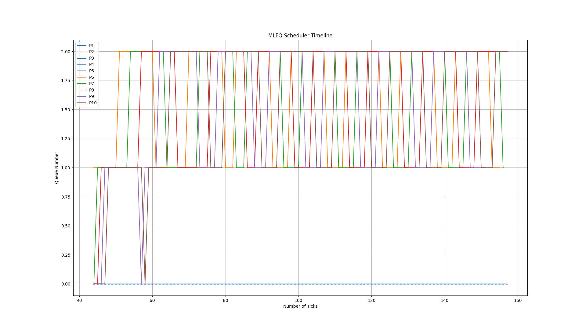
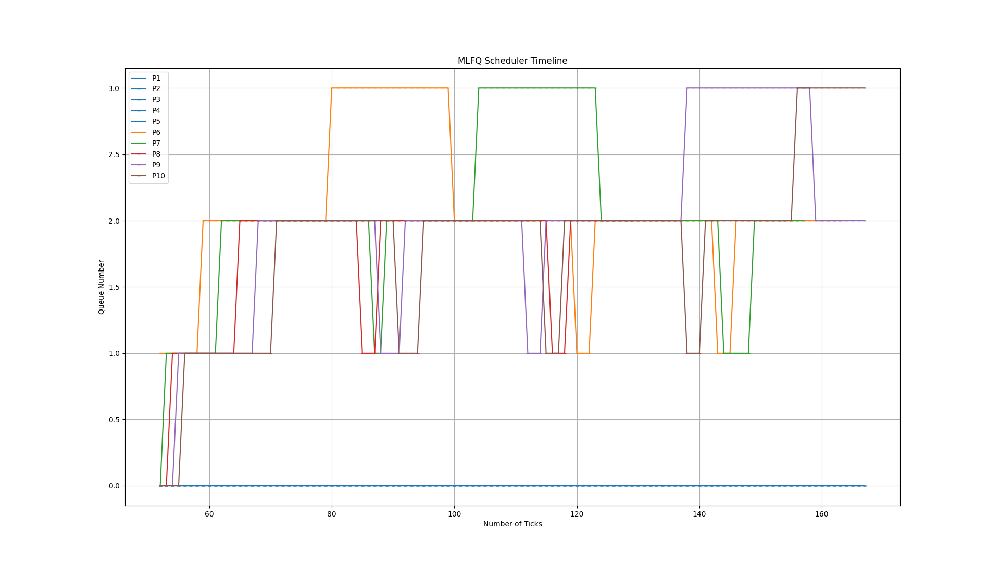
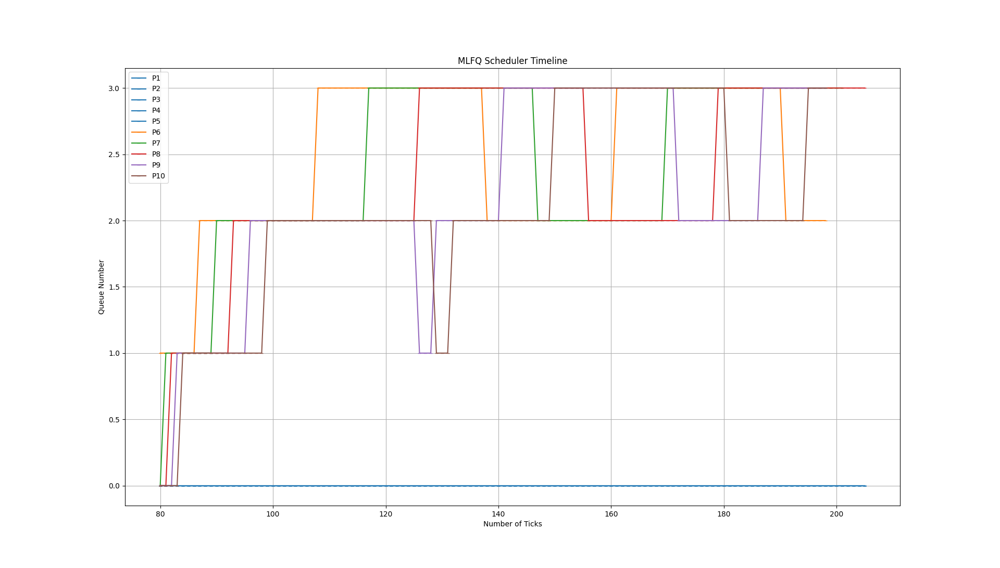
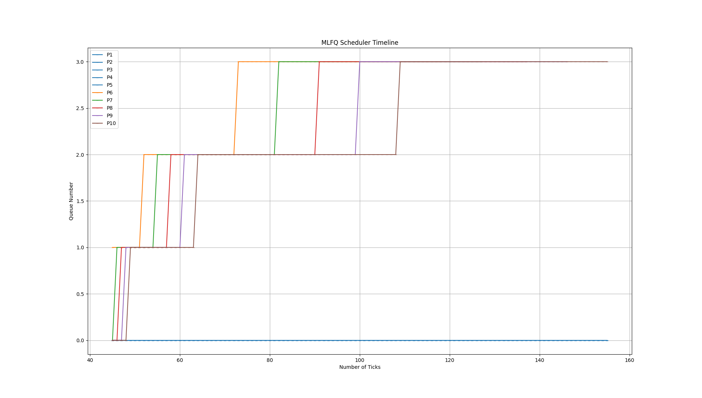

<!-- [](https://classroom.github.com/a/DLipn7os)-->

# Intro to Xv6 and Enhancing

<!-- OSN Monsoon 2023 mini project 2 -->

<!-- ## Some pointers
- main xv6 source code is present inside `initial_xv6/src` directory. This is where you will be making all the additions/modifications necessary for the first 3 specifications.
- work inside the `networks/` directory for the Specification 4 as mentioned in the assignment.
- Instructions to test the xv6 implementations are given in the `initial_xv6/README.md` file.

- You are free to delete these instructions and add your report before submitting.
 -->

xv6 is a re-implementation of Dennis Ritchie's and Ken Thompson's Unix
Version 6 (v6). xv6 loosely follows the structure and style of v6,
but is implemented for a modern RISC-V multiprocessor using ANSI C.

# Our Implementation

There are two Updations done in the project:

1. Implemented System Calls (get read count , sigalarm, sigreturn).
2. Implemented differnt Scheduling Policies.

The complete details of the Scheduling policies were made a Report.

Other than Xv6 Networks has two parts:

1. PartA has two subparts handling

   Basic UDP and TCP server and clients conection with send and receive functionality.

   A rock, paper, scissor Implementation using TCP and UDP

2. In PartB Implemented a TCP server and client using UDP by sending acknowledgements and accounting for flow control

# Specification 1: System Calls

## 1. getreadcount

$ `int getreadcount(void);`

The `readcount` system call provides the number of read operations done uptill the execution of getreadcount command.

## Implementation

1. **`readcount` System Call**

   - Added a global integer variable, `readcount`, to track read operations.
   - Introduced a spinlock, `readcount_lock`, to ensure concurrent access safety.
   - Implemented `sys_getreadcount` function to return `readcount` value.
   - Defined `getreadcount` entry points for system call numbers.

2. **Acquiring and Releasing Spinlock**

   - Protect the `readcount` variable with the `readcount_lock`.
   - Acquire the lock before incrementing `readcount` and release it afterward.

3. **System Call Registration**
   - Registered `sys_getreadcount` as a system call.
   - Enabled user-level processes to invoke the `readcount` system call.

## Usage

To use the `readcount` system call, a user-level program can call it as follows:

```c
test_1.c
#include "../kernel/types.h"
#include "../kernel/stat.h"
#include "user.h"

int
main(int argc, char *argv[]) {
    int x1 = getreadcount();
    int x2 = getreadcount();
    char buf[100];
    (void) read(4, buf, 1);
    int x3 = getreadcount();
    int i;
    for (i = 0; i < 1000; i++) {
        (void) read(4, buf, 1);
    }
    int x4 = getreadcount();
    printf("XV6_TEST_OUTPUT %d %d %d\n", x2-x1, x3-x2, x4-x3);
    exit(0);
}

```

test_1.c output

```c
XV6_TEST_OUTPUT 0 1 1000
```

## 2. Sigalarm and Sigreturn

The system calls `sigalarm` and `sigreturn` are designed to support interval-based alarms and signal handling within xv6.

## Implementation

### 1. `sigalarm` System Call

The `sigalarm` system call allows processes to set an interval-based alarm and specify a signal handler function. Here's how it's implemented:

- The process sets the alarm interval and handler function using `sigalarm(interval, handler)`.
- The alarm interval is provided as `interval`, and the handler function's address is provided as `handler`.
- If the interval is less than 0, an error is returned (-1).
- The process's `trap_alarm_status` is set to 0, indicating no active alarm.
- The process's `current_ticks` is updated upto the provided interval and the handler is called.
- The handler function's address is stored in the process's `handler` variable.
- If the interval is zero or negative, no alarm is set.

### 2. `sigreturn` System Call

The `sigreturn` system call allows processes to restore their state after handling a signal. Here's how it's implemented:

- The process calls `sigreturn()` to return from the signal handler.
- If no alarm was previously set (`trap_alarm_status` is 0) or if there was no associated trap frame (`sigalarm_trap` is 0), an error is returned (-1).
- The process's `trap_alarm_status` is reset to 0, indicating no active alarm.
- The process's `current_ticks` is reset to 0.
- The trap frame is copied from `sigalarm_trap` back to the process's `trapframe`.
- The system call returns the value in `a0` of the restored trap frame.

### 3. Signal Handling in xv6

Signal handling occurs in the trap handler. When the device generates an interrupt and there is no active alarm (`trap_alarm_status` is 0), a new trap frame is created, copying the current one. If the alarm interval (`current_ticks`) has expired, the `epc` in the trap frame is set to the address of the handler function, and the `trap_alarm_status` is set to 1, indicating an active alarm.

### 4. User-Level Access

To use the `sigalarm` and `sigreturn` system calls, user-level programs can call them as follows:

### Code to test these functions

<details>
<summary>Click to expand</summary>

```c
#include "kernel/param.h"
#include "kernel/types.h"
#include "kernel/stat.h"
#include "kernel/riscv.h"
#include "user/user.h"

void test0();
void test1();
void test2();
void test3();
void periodic();
void slow_handler();
void dummy_handler();

int main(int argc, char *argv[])
{
    test0();
    test1();
    test2();
    test3();
    exit(0);
}

volatile static int count;

void periodic()
{
    count = count + 1;
    printf("alarm!\n");
    sigreturn();
}

// tests whether the kernel calls
// the alarm handler even a single time.
void test0()
{
    int i;
    printf("test0 start\n");
    count = 0;
    sigalarm(2, periodic);
    for (i = 0; i < 1000 * 500000; i++)
    {
        if ((i % 1000000) == 0)
            write(2, ".", 1);
        if (count > 0)
            break;
    }
    sigalarm(0, 0);
    if (count > 0)
    {
        printf("test0 passed\n");
    }
    else
    {
        printf("\ntest0 failed: the kernel never called the alarm handler\n");
    }
}

void __attribute__((noinline)) foo(int i, int *j)
{
    if ((i % 2500000) == 0)
    {
        write(2, ".", 1);
    }
    *j += 1;
}

//
// tests that the kernel calls the handler multiple times.
//
// tests that, when the handler returns, it returns to
// the point in the program where the timer interrupt
// occurred, with all registers holding the same values they
// held when the interrupt occurred.
//
void test1()
{
    int i;
    int j;

    printf("test1 start\n");
    count = 0;
    j = 0;
    sigalarm(2, periodic);
    for (i = 0; i < 500000000; i++)
    {
        if (count >= 10)
            break;
        foo(i, &j);
    }
    if (count < 10)
    {
        printf("\ntest1 failed: too few calls to the handler\n");
    }
    else if (i != j)
    {
        // the loop should have called foo() i times, and foo() should
        // have incremented j once per call, so j should equal i.
        // once possible source of errors is that the handler may
        // return somewhere other than where the timer interrupt
        // occurred; another is that that registers may not be
        // restored correctly, causing i or j or the address ofj
        // to get an incorrect value.
        printf("\ntest1 failed: foo() executed fewer times than it was called\n");
    }
    else
    {
        printf("test1 passed\n");
    }
}

//
// tests that kernel does not allow reentrant alarm calls.
void test2()
{
    int i;
    int pid;
    int status;

    printf("test2 start\n");
    if ((pid = fork()) < 0)
    {
        printf("test2: fork failed\n");
    }
    if (pid == 0)
    {
        count = 0;
        sigalarm(2, slow_handler);
        for (i = 0; i < 1000 * 500000; i++)
        {
            if ((i % 1000000) == 0)
                write(2, ".", 1);
            if (count > 0)
                break;
        }
        if (count == 0)
        {
            printf("\ntest2 failed: alarm not called\n");
            exit(1);
        }
        exit(0);
    }
    wait(&status);
    if (status == 0)
    {
        printf("test2 passed\n");
    }
}

void slow_handler()
{
    count++;
    printf("alarm!\n");
    if (count > 1)
    {
        printf("test2 failed: alarm handler called more than once\n");
        exit(1);
    }
    for (int i = 0; i < 1000 * 500000; i++)
    {
        asm volatile("nop"); // avoid compiler optimizing away loop
    }
    sigalarm(0, 0);
    sigreturn();
}

//
// dummy alarm handler; after running immediately uninstall
// itself and finish signal handling
void dummy_handler()
{
    sigalarm(0, 0);
    sigreturn();
}

//
// tests that the return from sys_sigreturn() does not
// modify the a0 register
void test3()
{
    uint64 a0;

    sigalarm(1, dummy_handler);
    printf("test3 start\n");

    asm volatile("lui a5, 0");
    asm volatile("addi a0, a5, 0xac" : : : "a0");
    for (int i = 0; i < 500000000; i++)
        ;
    asm volatile("mv %0, a0" : "=r"(a0));

    if (a0 != 0xac)
        printf("test3 failed: register a0 changed\n");
    else
        printf("test3 passed\n");
}
```

</details>

### Test Results for the alarmtest command

```c
test0 start
..................................................................alarm!
test0 passed
test1 start
.....alarm!
..alarm!
...alarm!
.alarm!
..alarm!
..alarm!
..alarm!
...alarm!
..alarm!
..alarm!
test1 passed
test2 start
................................................alarm!
test2 passed
test3 start
alarm!
alarm!
test3 passed
```

# Specification 2: Scheduling

The following Project was Executed in three Scheduling Policies:

1. Round-Robin (RR)
2. First Come First-Served (FCFS)
3. Multi-level Feedback Queue (MLFQ)

These are the Policies implemented. It can be used by running:

```bash
make clean
make qemu SCHEDULER=<Schedulertype>
```

Here < schedulertype > can be DEFAULT for RR , FCFS for FCFS, MLFQ for MLFQ

## First Come First-Served

FCFS is a simple scheduling algorithm where processes are executed in the order they arrive. The Processes that come first will be executed first.

## Implementation

#### In `usertrap` and `kernel`:

Yield is disabled inorder to handle preemption cause the process should run till completion without preemption.

```c
usertrap()
#ifndef FCFS
  if (which_dev == 2)
    yield();
#endif
```

```c
kerneltrap()
ifndef FCFS
  if (which_dev == 2 && myproc() != 0 && myproc()->state == RUNNING)
    yield();
#endif
```

### In proc.c

The schedule policy is determined by ifdef in the scheduler function

```c
#ifdef FCFS
  for (;;)
  {
    intr_on();
    struct proc *pres_proc = 0;
    for (p = proc; p < &proc[NPROC]; p++)
    {
      if (p->state == RUNNABLE && (pres_proc == 0 || pres_proc->ctime > p->ctime))
      {
        pres_proc = p;
      }
    }
    if (pres_proc != 0)
    {
      if (pres_proc->state == RUNNABLE)
      {
        acquire(&pres_proc->lock);
        pres_proc->state = RUNNING;
        c->proc = pres_proc;
        swtch(&c->context, &pres_proc->context);
        c->proc = 0;
        release(&pres_proc->lock);
      }
      release(&p->lock);
    }
  }
#endif
```

Here the ctime is compared which is the arrival time and the minimum is taken and was run. Since there is no preemption (Yield), It will run till its end.

## Output

```bash
Process 5 finished
Process 6 finished
Process 7 finished
Process 8 finished
Process 9 finished
Process 0 finished
Process 1 finished
Process 2 finished
Process 3 finished
Process 4 finished
Average rtime 11,  wtime 123
```

## Usage

To enable FCFS scheduling during the compilation of xv6, use the `FCFS` flag. For example:

```bash
make clean
make qemu SCHEDULER=FCFS
```

## Multilevel Feedback Queue

Multi-Level Feedback (MLFQ) is a sophisticated scheduling algorithm that employs multiple queues with varying priorities (0 has highst priority and decreases till 3) to manage processes efficiently. These queues has their own time slices to send the running process to next level and also the other processes in the same Queue runs in Round Robin.

## Graphs

**For waittime of 10 ticks**



```bash
Output: Average rtime 11,  wtime 146
```

**For waittime of 20 ticks**



```bash
Output: Average rtime 11,  wtime 139
```

**For waittime of 30 ticks**



```bash
Output: Average rtime 11,  wtime 143
```

**For waittime of 40 ticks**



```bash
Output: Average rtime 11,  wtime 139
```

## Implementation

### 1. Process Structure Modifications

Several fields have been added to the `struct proc` to support MLFQ scheduling:

- `que_no`: Denotes the queue number where the process is placed.
- `proc_no`: Represents the position of the process in its queue.
- `que_on`: Indicates whether the process is in a queue or not.
- `wait_time`: Tracks the waiting time of the process.
- `stime`: Records the time the process has spent in the RUNNING state.

### 2. MLFQ Queues

Four MLFQ queues are implemented, each with a different maximum time constraint {1, 3, 9, 15}. Processes move between these queues based on their behavior.

### 3. Initialization

The `init_que` function initializes the MLFQ queues with specific maximum time constraints given and que_on and que_no with 0.

### 4. Queue Operations

- `mlfq_push`: Adds a process to a queue at back.
- `mlfq_push_front`: Adds a process to the front of a queue.
- `mlfq_pop`: Removes and returns a process from a queue.
- `deque`: Removes the given process from a queue.

### 5. Scheduling Logic

In the `scheduler` function, processes are placed into queues based on their state (if RUNNING) and que-on status is updated to 1. Processes are moved between queues to ensure they meet their wait time constraints. Here the first process in the least priority is selected and popped, if it is runnable, insert it again in the front of queue to run it again after returning back from trap, when the running time goes greater than assigned time slice, the que_no is increased to push to next level by popping it. When the waittime of a process is morethan given waittime limit, the que_no is decreased to get more priority.

Process:

In sechuduler function

a. The Runnable processes in the `proc` array is pushed at back of que_no (initialised with 0) by checking if it is already in queue. The que_on flag is set to 1 to indicate its presence in Queue.

```c
struct proc *p = 0;
    for (p = proc; p < &proc[NPROC]; p++)
    {
      if (p->state == SLEEPING || p->state == UNUSED)
      {
        continue;
      }
      if (p->state == RUNNABLE && p->que_on == 0)
      {
        int que_no = p->que_no;
        mlfq_push(p, que_no);
        p->que_on = 1;
      }
    }
```

b. Selecting the first Runnable process in the first non empty queue by popping out queues continuously until a Runnable process was found. When found Push it again in the front of the Queue.

```c
struct proc *pres_proc = 0;
for (int i = 0; i < 4; i++)
    {
      if (pres_proc != 0)
      {
        break;
      }
      while (mlf_Que[i].tail > 0)
      {
        pres_proc = mlfq_pop(i);
        pres_proc->que_on = 0;
        if (pres_proc->state == RUNNABLE)
        {
          mlfq_push_front(pres_proc, pres_proc->que_no);
          break;
        }
      }
    }
```

c. Running the found Runnable Process by context switching and CPU running process to present found process.

```c
if (pres_proc != 0)
    {
      if (pres_proc->state == RUNNABLE)
      {
        acquire(&pres_proc->lock);
        pres_proc->state = RUNNING;
        c->proc = pres_proc;
        swtch(&c->context, &pres_proc->context);
        c->proc = 0;
        release(&pres_proc->lock);
      }
    }
```

In usertrap function

d. Check if the Running time of the Process of present Running process is more than time slice of present Queue. If it is greater pop the queue and increase the queue level (decrease priority) of the process such that it can be added to next level queue when it goes to scheduler again. Again reseting the runtime (stime) and also wait time starts from now. The que_no is left 3 it is in queue 3. As it always add it to last of Queue if que_on is 0.

```c
    if (p->stime > mlf_Que[p->que_no].max_ticks)
    {
      if (mlf_Que[p->que_no].tail > 0)
      {
        mlfq_pop(p->que_no);
        p->que_on = 0;
      }
      if (p->que_no < 3)
      {
        p->que_no++;
      }
      p->stime = 0;
      p->wait_time = 0;
    }
```

e. Inorder to prevent ageing, check if the wait_time of the processes which are RUNNABLE and increase their priority (decraese queue level) if it more than some predefined threshhold (reset point) inorder to boost it to high priority by removing from present queue and again going to scheduler function.

```c
  for (struct proc *pres_proc = proc; pres_proc < &proc[NPROC]; pres_proc++)
  {
    if (pres_proc != 0 && pres_proc->state == RUNNABLE && pres_proc->que_on == 1)
    {
      if (pres_proc->wait_time >= 30)
      {
        pres_proc->que_on = 0;
        deque(pres_proc->que_no, pres_proc);
        if (pres_proc->que_no > 0)
        {
          pres_proc->que_no--;
        }
        pres_proc->wait_time = 0;
      }
    }
  }
```

As the processes at least priority runs first, the processes run in Round robin as the next element of present running process will be first process if present running process goes to next queue or added at last.

### 6. Yield Behavior

The `yield` function ensures that processes go to RUNNABLE state from RUNNING. if they are in the SLEEPING state (got from premption as to reserve parent process until child completes), it is left in sleep state, preventing preemption errors.

```c
void yield(void)
{
  struct proc *p = myproc();
  acquire(&p->lock);
  p->state = RUNNABLE;
#ifdef MLFQ
  if (p->state != SLEEPING)
  {
#endif
    p->state = RUNNABLE;
#ifdef MLFQ
  }
#endif
  sched();
  release(&p->lock);
}
```

### 7. Updating Process Statistics

In the `updatetime` function, process statistics such as `stime` and `wait_time` are updated to track the time spent in Running and Waiting Period.

## Output for 30 Waittime

```bash
Process 8 finished
Process 5 finished
Process 9 finished
Process 6 finished
Process 7 finished
Process 0 finished
Process 1 finished
Process 2 finished
Process 3 finished
Process 4 finished
Average rtime 12,  wtime 145
```

## Usage

To enable MLFQ scheduling during the compilation, use the `MLFQ` flag. For example:

```bash
make clean
make qemu CPUS=1 SCHEDULER=MLFQ
```

# Specification 4 : Networking

## Part A : Using library functions

## TCP (Transmission Control Protocol)

**TCP Server Implementation**

### Socket Creation

The server creates a socket using the socket() function with the AF_INET (IPv4) address family and SOCK_STREAM socket type.

### Binding

The bind() function binds the server socket to a specific IP address and port using the server_address structure.

### Listening

The listen() function makes the server socket listen for incoming connections, with a specified backlog of 5 pending connections.

### Accepting Client Connections

The server enters a loop and uses the accept() function to accept incoming client connections. It creates a new socket for each connected client.

### Receiving Messages

The server uses the recv() function to receive messages from connected clients. Received messages are printed to the console.

### Sending Messages

The server sends a response message to clients using the send() function.

### Closing Connection

Closes the client socket after communication.

The server keeps on running till user stops the Server.

## Usage:

```bash
gcc tcp_server.c -o tcp_server
./tcp_server
```

**TCP Client Implementation**

### Socket Creation

The client creates a socket using the socket() function with the AF_INET (IPv4) address family and SOCK_STREAM socket type.

### Connection

The client sets up connection parameters (server IP address and port) and uses the connect() function to establish a connection to the server.

### Sending Messages

The client uses the send() function to send a message to the server.

### Receiving Messages

The client uses the recv() function to receive a response message from the server.

The implementation of Client is such a way that user have to give input (1 or 0) to send message to the server or stop connection.

## Usage:

```bash
gcc tcp_client.c -o tcp_client
./tcp_client
```

## UDP (User Datagram Protocol)

**UDP Server Implementation**

## Socket Creation

The server creates a UDP socket using the socket() function with the AF_INET (IPv4) address family and SOCK_DGRAM socket type.

## Binding

## The bind() function binds the server socket to a specific IP address and port using the server_address structure.

## Receiving Messages

The server uses the recvfrom() function to receive messages from connected clients.

## Sending Messages

The server uses the sendto() function to send responses to clients.

The server keeps on running till user stops the Server.

## Usage:

```bash
gcc udp_server.c -o udp_server
./udp_server
```

**UDP Client Implementation**

## Socket Creation

The client creates a UDP socket using the socket() function with the AF_INET (IPv4) address family and SOCK_DGRAM socket type.

## Sending Messages

The client uses the sendto() function to send messages to the server. It specifies the server's IP address and port, along with the message to send.

## Receiving Messages

The client uses the recvfrom() function to receive response messages from the server.

The implementation of Client is such a way that user have to give input (1 or 0) to send message to the server or stop connection.

## Usage:

```bash
gcc udp_client.c -o udp_client
./udp_client
```

# Rock, Paper, Scissors Using TCP and UDP

## Using TCP

`TCP Server`:

1. The server listens on two different ports (6667 and 6666) to accept connections from two clients.
2. It receives the choices made by both clients, determines the winner, and sends the game result to each client.
3. The server allows clients to play another round or exit (0 or 1).

`TCP Client`:

1. Clients connect to the server using the specified port.
2. They make their choices (rock, paper, or scissors) by entering the corresponding numbers (0, 1, or 2).
3. Clients receive the game result and can choose to play again or exit.

## Usage:

```bash
- Server

gcc tcp_server_rpc.c -o tcp_server_rpc
./tcp_server_rpc

- Client

gcc tcp_client_rpc.c -o tcp_client_rpc
./tcp_client_rpc <port> (two times for both clients)

Here 6667 and 6666 are used as ports

```

## Using UDP

`UDP_Server`:

1. The server listens on two different ports (8080 and 8081) to accept connections from two clients.
2. It receives the choices made by both clients, determines the winner, and sends the game result to each client.
3. The server allows clients to play another round or exit (0 or 1).

`UDP_Client`:

1. Clients connect to the server using the specified port.
2. They make their choices (rock, paper, or scissors) by entering the corresponding numbers (0, 1, or 2).
3. Clients receive the game result and can choose to play again or exit (0 or 1).

## Usage:

```bash
- Server

gcc udp_server_rpc.c -o udp_server_rpc
./udp_server_rpc

- Client

gcc udp_client_rpc.c -o udp_client_rpc
./udp_client_rpc <port> (two times for both clients)

Here 8080 and 8081 are used as ports
```

# Implement some TCP (?) functionality from scratch

## UDP-Based Data Transmission with Sequencing and Retransmission

UDP (User Datagram Protocol) is a connectionless protocol that does not guarantee the order or reliability of data transmission. However, this implementation adds custom features to UDP to provide data sequencing and retransmission, similar to the behavior of TCP (Transmission Control Protocol).

`Client`:

1. The UDP client converts message into fixed size chunks and sends data chunks to the server without establishing a connection.
2. There is no guaranteed delivery or sequencing of packets.
3. The client sends chunks of data, and the server acknowledges each chunk.
4. Retransmission is implemented by resending unacknowledged chunks after 0.1 seconds without waiting for the acknowledgement. This functionality was made using `select()` function.
5. After received all the acknowledgements it sends a final message saying all done.
6. Then it starts receiving from the server and sends acknowledgement for the received chunks.
7. Flow control and congestion control are not explicitly implemented in this UDP implementation.

`Server`:

1. The UDP server listens for incoming data chunks on a predefined port.
2. It acknowledges the receipt of each chunk and processes them independently.
3. The server does not maintain a connection state with clients.
4. Retransmission is handled by the client if it does not receive acknowledgments.
5. After getting all the chunks from the client, the server prints the message and then it sends message by chunks.
6. Retransmission is implemented by resending unacknowledged chunks after 0.1 seconds without waiting for the acknowledgement. This functionality was made using `select()` function.
7. After all the successful sent chunks it sends a final one saying to close.
8. Flow control and congestion control are not implemented.

# Questions Asked:

## How is your implementation of data sequencing and retransmission different from traditional TCP?

In the provided code, the implementation of data sequencing and retransmission over UDP is different from traditional TCP in the following ways:

`UDP vs TCP`: UDP is a connectionless protocol, while TCP is connection-oriented. In TCP, there is an established connection between the sender and receiver with reliable, ordered, and error-checked data transmission. UDP, on the other hand, lacks these features by design.

`Data Sequencing in UDP`: In the UDP-based implementation, data sequencing is implemented manually using sequence numbers (seq_no). Each data chunk is assigned a unique sequence number to maintain the order of data transmission. This approach allows the sender and receiver to keep track of the order of data chunks.

`Retransmission in UDP`: The code includes a mechanism for retransmitting data chunks if they are not acknowledged by the receiver in 0.1 seconds sending other data not waiting for this. This is achieved through a loop that continually checks for unacknowledged chunks and retransmits them until acknowledgment is received.

`Selective Acknowledgment`: The code uses selective acknowledgment, where the receiver sends an acknowledgment containing the sequence number of the successfully received chunk. This allows the sender to retransmit only the missing or unacknowledged chunks, reducing unnecessary retransmissions.

`Non-blocking Socket`: The UDP socket is set to non-blocking mode (O_NONBLOCK), allowing the sender to continue other operations while waiting for acknowledgments. This differs from TCP, where the sender typically waits for acknowledgments before proceeding.

## How can you extend your implementation to account for flow control?

To account for flow control in the current UDP-based implementation, you can implement a mechanism that prevents the sender from overwhelming the receiver with too much data too quickly. Here's how you can extend the implementation for flow control:

`Sender-Based Flow Control`: Implement a mechanism on the sender side to monitor the receiver's buffer space availability. The sender should keep track of the receiver's buffer capacity and adapt its sending rate accordingly.

`Window-Based Flow Control`: Implement a sliding window mechanism where the sender sends data within a dynamically adjusted window size. The window size indicates the number of unacknowledged chunks allowed in flight at any given time. The sender can adjust the window size based on the receiver's buffer availability and network conditions.

`Receiver's ACKs`: The receiver can send acknowledgments that not only acknowledge the received data but also indicate the available buffer space. For example, the receiver can include the number of free bytes in its acknowledgment.

`Sender's Sending Rate`: The sender should control its sending rate based on the receiver's acknowledgment and available buffer space. It should slow down or pause sending if the receiver's buffer is full and resume when space becomes available.

`Congestion Avoidance`: Implement congestion avoidance mechanisms, such as exponential backoff or congestion window adjustment, to adapt to network congestion and prevent packet loss.

`Error Handling`: Handle situations where the sender receives indications of congestion or buffer overflow from the receiver. This may involve temporarily reducing the sending rate or applying other congestion control techniques.

By implementing these flow control mechanisms, the UDP-based implementation can achieve a more controlled and efficient data transfer, similar to how TCP manages flow control in a reliable manner. However, it's important to note that UDP-based flow control is typically more application-specific and may not provide the same level of reliability and congestion control as TCP.
